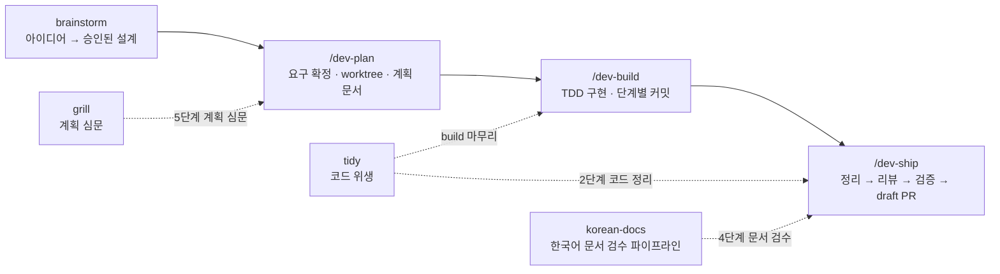

# ruccess/skills

[](LICENSE)
[](https://docs.anthropic.com/en/docs/claude-code)
[](#codex)

개발 작업을 계획에서 draft PR까지 끌고 가는 에이전트 스킬 스위트다. 산출물 품질 스킬을 함께 담는다.
Agent skills that carry a dev task from plan to draft PR — with gates, not vibes. Writing-quality skills included.



## 왜 만들었나

에이전트에게 "PR 올려줘"라고 하면 곧장 `git push`와 PR 생성으로 직행한다. 하지만 실제 측정에서 보면 에이전트는 정리 단계를 건너뛰고, 문서 검수를 빼먹으며, draft가 아닌 일반 PR을 만든다. 구현 완료와 출하 가능은 다르다. 이 스위트는 그 사이를 메운다.

## 워크플로우 스킬

### `brainstorm` — 아이디어를 승인된 설계로

구현 행동 금지 게이트에서 시작한다 — 설계를 제시하고 승인받기 전에는 코드가 없다. 질문은 한 번에 하나씩(다지선다 선호), 접근 2~3개를 트레이드오프와 함께 제안하고, 승인된 설계를 짧은 문서로 남긴다. [obra/superpowers](https://github.com/obra/superpowers)의 brainstorming을 증류한 경량판이다.

### `/dev-plan` — 작업 시작

코드보다 계획이 먼저다. 요구를 확정하고 작업 공간을 격리한 뒤 계획 문서를 남긴다. 프로젝트에 자체 작업 시작 스크립트가 있으면 그것을 따르고, 없으면 git worktree로 브랜치를 격리한다. 아이디어가 아직 흐릿하면 brainstorm부터 시작하고, 계획 확정 전에는 grill로 심문한다.

### `grill` — 계획 심문

결정 트리의 모든 가지를 질문으로 하나씩 해소한다 — 각 질문에 추천 답을 붙이고, 코드가 답할 수 있는 건 묻지 않고 읽는다. 용어는 프로젝트 용어집(CONTEXT.md)과 대조하고, 해소된 결정은 바로 문서에 남긴다. ADR은 되돌리기 어렵고·맥락 없이 놀랍고·진짜 트레이드오프일 때만 작성한다. grill-with-docs를 증류한 경량판이다.

### `/dev-build` — 구현

계획 문서가 없으면 구현하지 않는다. TDD 루프(실패 테스트 → 최소 구현 → 리팩터)로 계획의 각 단계마다 커밋하고 검증한다. 계획에서 벗어나야 하면 멈추고 계획부터 갱신한다. 마무리는 tidy 스킬로 코드 위생을 정리하고 검증을 한 번 더 돌린다.

### `/dev-ship` — 마무리와 draft PR

일곱 단계를 순서대로 통과해야 PR이 나간다.

| 단계 | 내용 | 게이트 |
|---|---|---|
| 1 | 변경 파악 | `git diff <base>...HEAD` 전체 확인 |
| 2 | 코드 정리 | tidy 스킬 — 동작 보존 정리만, 기능 추가 금지 |
| 3 | 리뷰 | CRITICAL·HIGH 수정, MEDIUM 이하 보고 |
| 4 | 문서 검수 | 한국어 문서가 있으면 korean-docs 파이프라인 진행 |
| 5 | 검증 | 테스트·린트 실패 시 여기서 정지 |
| 6 | 거버넌스 | 프로젝트의 체크리스트·리뷰 트리거·ADR 요건 확인 |
| 7 | draft PR | 생성 직전 요약 보고 후 `--draft`로 생성 — draft만이 기본 |

## 산출물 품질 스킬

AI가 쓴 글은 티가 난다 — 번역투, 이중 피동, 상투어. 두 스킬이 채팅과 문서를 각각 담당한다.

### `korean-chat` — 응답·메시지

해라체 결론 리드 한 문장, 개조식 불릿, 다음 행동 한 줄. 인사·헤징·재진술을 담화에서 제거하되 조사·어미를 유지해 번역투를 막는다.

### `korean-docs` — 문서 산출·검수

문서는 완결 산문으로 쓴다. 커밋 전에는 [DaleSeo/korean-skills](https://github.com/DaleSeo/korean-skills)의 humanizer → grammar-checker를 서브에이전트 파이프라인으로 돌린다. `/dev-ship` 4단계가 이 스킬을 호출한다.

### `tidy` — 코드 위생

동작 보존 정리만 한다 — 데드코드, 디버그 잔재, 파일 위치, 네이밍 드리프트, 함수 크기. 기능 변경과 정리 커밋을 섞지 않는다(Tidy First). `/dev-build` 마무리와 `/dev-ship` 2단계가 호출한다.

## 토큰 경제

### `context-thrift` — 컨텍스트를 돈처럼 쓴다

툴 호출 하나가 대화 전체를 다시 읽는다 — 비용 ≈ 호출 수 × 컨텍스트 크기. 독립 호출은 한 메시지에 배칭, 출력은 잘라서 수신, 기계적 탐색은 싼 모델 서브에이전트에 위임, 대기는 폴링 대신 백그라운드로. 실측 근거를 담았다: 855콜이 854메시지에 흩어진 세션(병렬도 1.00)은 왕복만으로 캐시 읽기 4억 토큰을 태웠다.

## 설계 원칙

- **저장소 규칙 우선** — 커밋 형식·브랜치·PR·검증 명령은 대상 저장소의 지침이 결정한다. 스킬은 순서와 게이트만 정의한다
- **얇은 오케스트레이션** — 프로젝트에 이미 있는 시작 스크립트·실행 루프·리뷰 에이전트를 재사용한다. 스킬이 바퀴를 다시 만들지 않는다
- **draft가 기본** — PR은 항상 draft로 시작한다. 검증 실패 상태의 PR은 존재하지 않는다

## 설치

### Claude Code

```bash
claude plugin marketplace add ruccess/skills
claude plugin install ruccess@ruccess
```

korean-docs의 검수 파이프라인은 [DaleSeo/korean-skills](https://github.com/DaleSeo/korean-skills) 플러그인을 함께 설치해야 동작한다.

```bash
claude plugin marketplace add DaleSeo/korean-skills
claude plugin install korean-skills@korean-skills
```

### Codex

스킬 본문은 런타임 중립 markdown이라 그대로 프롬프트로 사용한다.

```bash
git clone https://github.com/ruccess/skills ~/ruccess-skills
for s in brainstorm dev-plan grill dev-build dev-ship korean-chat korean-docs tidy context-thrift; do
  ln -sf ~/ruccess-skills/skills/$s/SKILL.md ~/.codex/prompts/$s.md
done
```

## 로드맵

- **v0.5** — 한글 감지 리마인드 hook 동봉, 스킬별 테스트 시나리오 문서화(베이스라인 → 검증 재현 절차), using-ruccess 라우터 스킬(상시 주입 없이 목록만으로 라우팅)
- **v1.0** — 팀 공유용 안정판

## License

[MIT](LICENSE)
